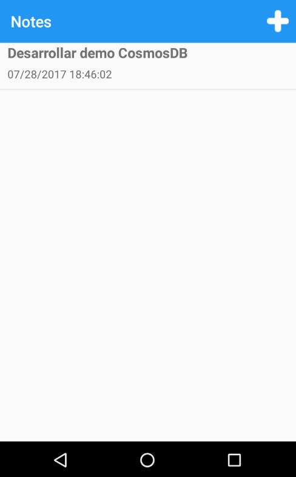

# Xamarin.Forms CosmoDB Demo

Application to take notes made with Xamarin.Forms using .NET Standard and **CosmosDB**.

The app targets two platforms:

- iOS
- Android

## Requirements

- Visual Studio 2015 (14.0 or higher) to compile C# 6 language features (or Visual Studio MacOS)
- Xamarin add-ons for Visual Studio (available via the Visual Studio installer)
- Visual Studio Community Edition is fully supported!
- Android SDK Tools 25.2.3 or higher
- JDK 8.0

## Copyright and license

Code released under the MIT license.